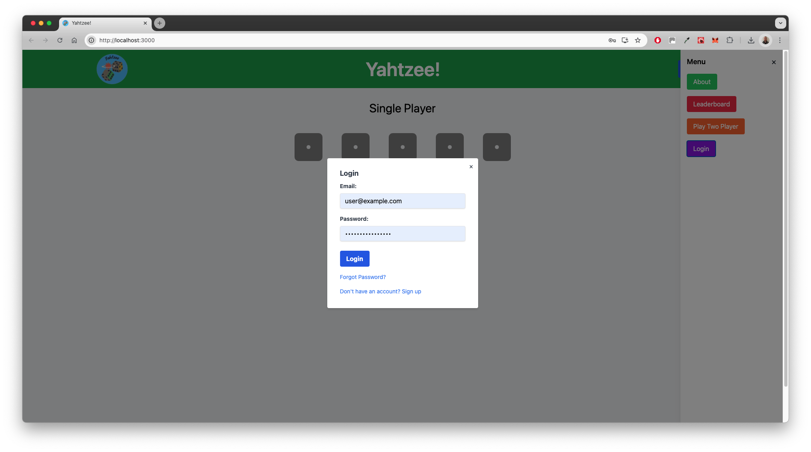
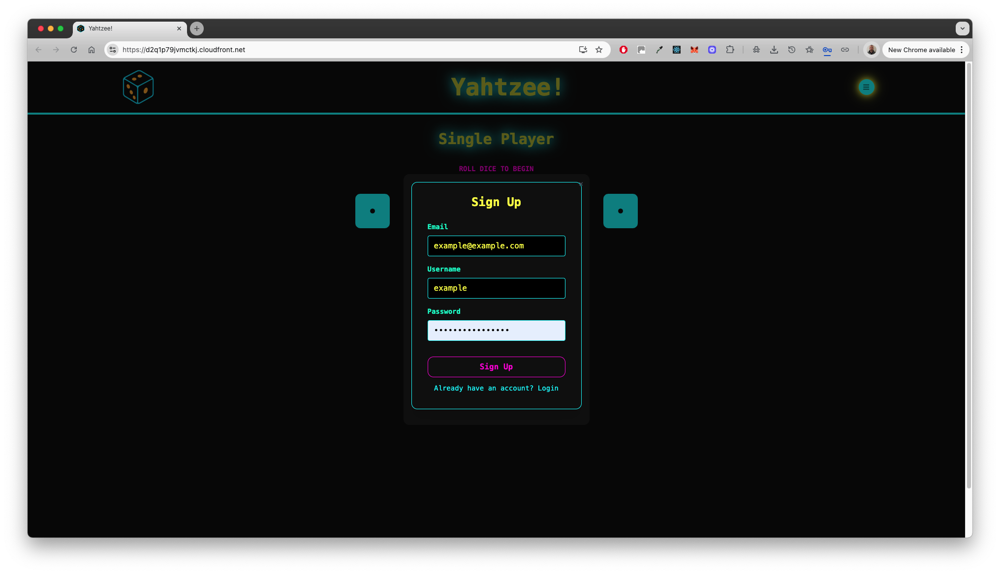
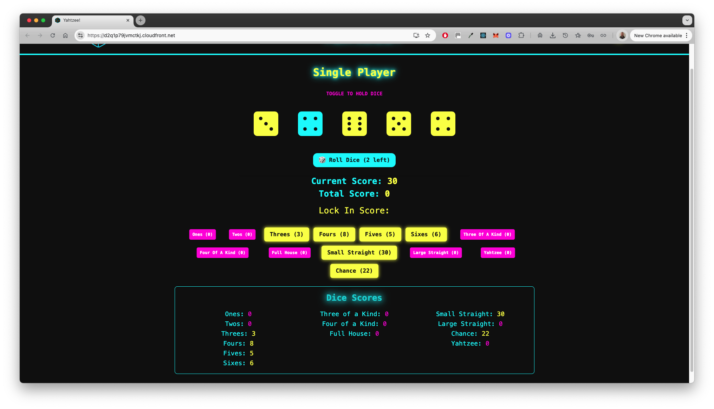
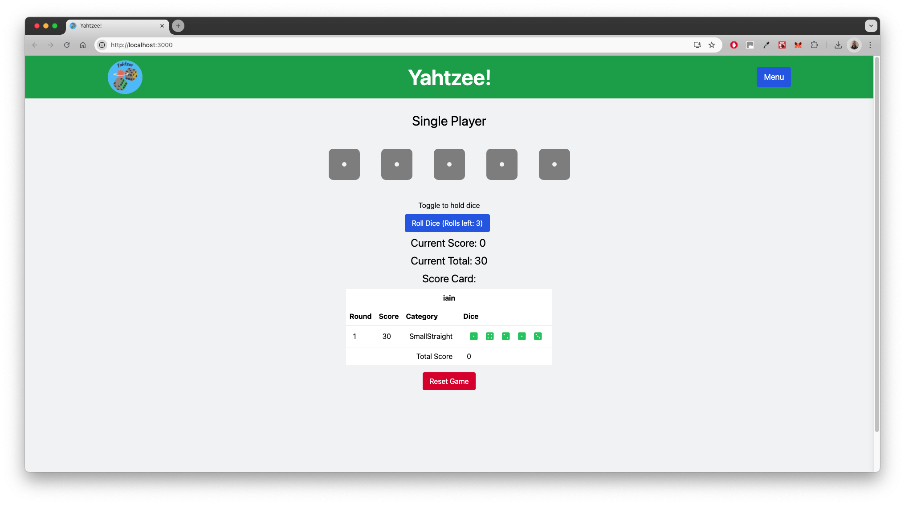
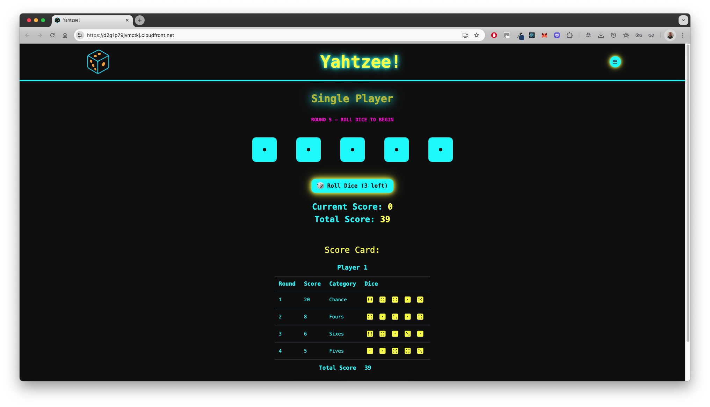
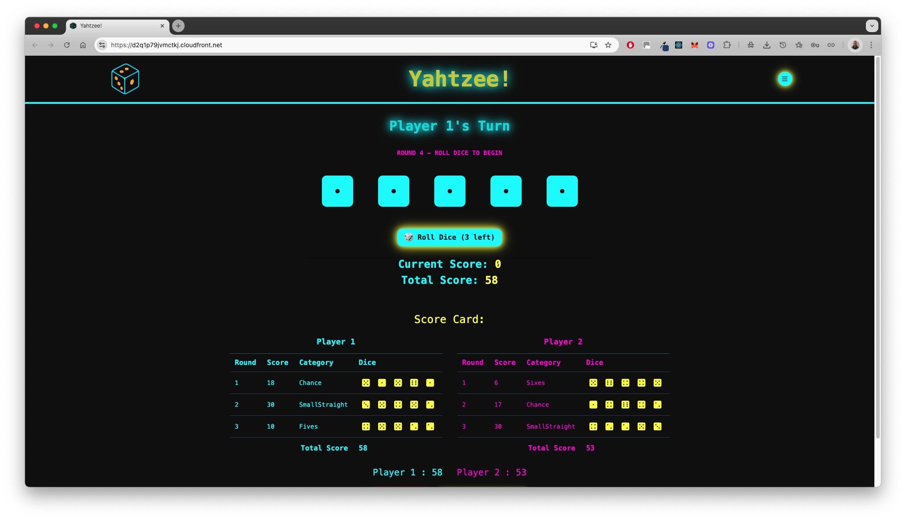
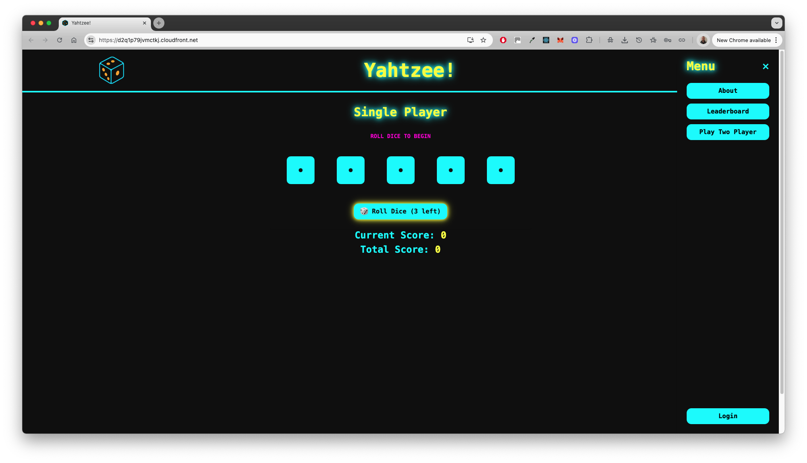
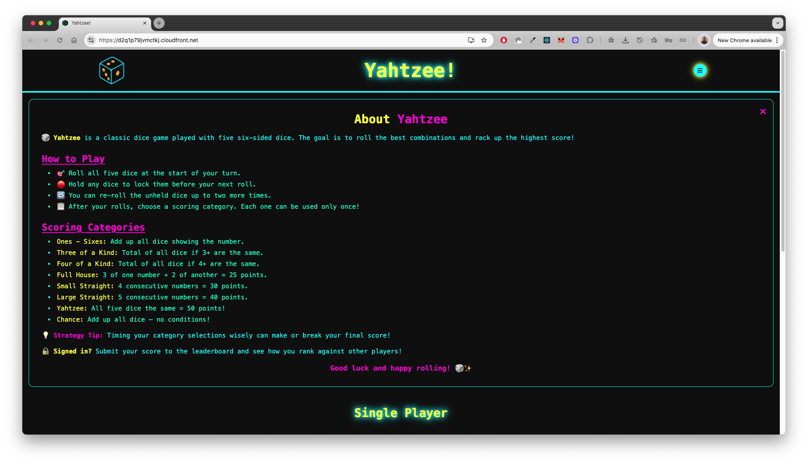
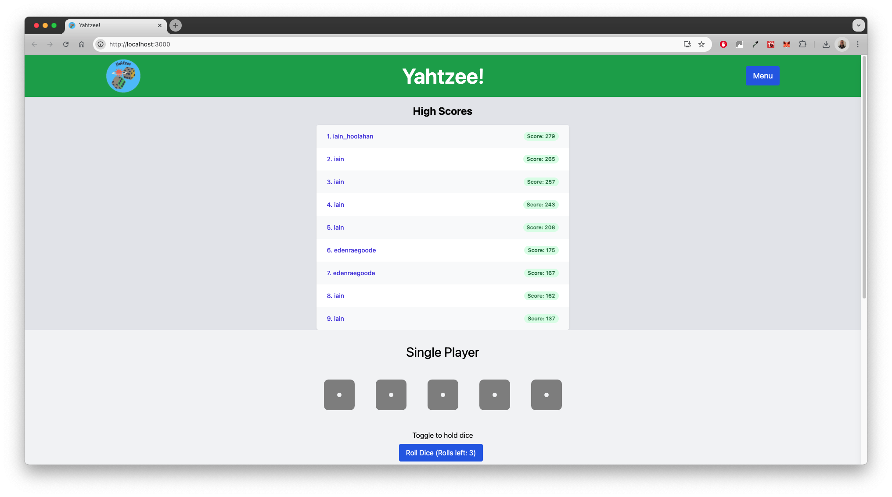
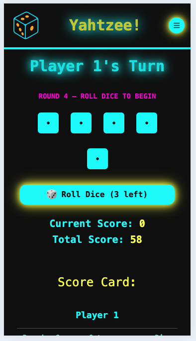

# Yahtzee! Game in React with AWS Integration

## Description

This project is an interactive Yahtzee! game web application developed with React and TypeScript. This digital version of the classic dice game includes features like holding dice, rerolling, and automated score calculations following the official Yahtzee rules. The app integrates AWS Amplify for hosting, AWS Cognito for user authentication, and AWS DynamoDB for persistent storage of leaderboard scores.

## Deployed Page

Access the live application [here](https://d2q1p79jvmctkj.cloudfront.net/).

## Features

🎲 Interactive Dice Mechanics: Roll 5 virtual dice per turn, with glowing feedback and animations.

✋ Hold Dice Between Rolls: Toggle individual dice to lock their values before re-rolling remaining dice (up to 3 rolls per turn).

🧮 Smart Score Detection: Automatically calculates valid scoring options based on current dice, with highlights and tooltips.

📊 Complete Yahtzee Scoring System, including:

- Ones through Sixes
- Three of a Kind
- Four of a Kind
- Full House
- Small Straight
- Large Straight
- Yahtzee
- Chance

🔐 User Authentication: Secure sign-up, login, and password reset flows via AWS Cognito.

🧑‍🤝‍🧑 Single & Two Player Modes: Play solo or against a friend with alternating turns and separate score tracking.

🏆 Leaderboard: Global ranking system with DynamoDB backend — see how your score stacks up!

📱 Responsive UI: Mobile-friendly layout with clean scaling and glowing theme aesthetics.

💡 Dynamic UI Feedback: Score locking, animated buttons, visual dice states, and themed colour transitions.

🔁 Game Reset & Score Sharing: Start a new round anytime or share your completed scorecard.

🧭 In-App Navigation: Toggleable menu for switching between gameplay, leaderboard, settings, and about screens.


## Demo

### 🔐 User Authentication

**Login/Sign Up Form**  
Secure user sign-in using AWS Cognito:



**Sign Up Form**  
Users can create accounts with email verification:



---

### 🎮 Gameplay (Single Player)

**Holding Dice**  
Clicking dice allows players to hold values between rolls:



**Locking in Scores**  
Once a valid combination is rolled, users can lock in scores:



**Scorecard View**  
Displays category, dice, and cumulative score:



---

### 👥 Two Player Mode

Alternate turns and separate scoring tracked between players:



---

### 🧭 Navigation & UI

**Main Menu**  
Access key features such as the game, leaderboard, about, and settings:



---

### 📝 About Page

Detailed instructions and rules for new users:



---

### 🏆 Leaderboard

Scores submitted by users are saved and ranked using AWS DynamoDB:



---

### 📱 Mobile Responsive Design

UI adapts for smaller screens with clean layout and functionality:



---

## Architecture

The application's frontend is built using React and TypeScript, with state management handled via React's Context API. AWS Amplify facilitates the frontend deployment and hosting, AWS Cognito provides user authentication services, and AWS DynamoDB is used for storing and retrieving leaderboard data.

## Project Structure

```
├── .github/workflows       # CI/CD pipelines
├── .vscode                 # VSCode workspace settings
├── amplify                 # AWS Amplify backend resources
├── public                  # Static assets
├── src                     # Application source code
│   ├── components          # UI components
│   │   ├── auth            # AuthenticationManager.tsx, EmailVerificationForm.tsx, LoginForm.tsx, SignUpForm.tsx
│   │   ├── common          # About.tsx, Leaderboard.tsx, Settings.tsx
│   │   ├── game            # All Yahtzee gameplay components (CategoryButtons, CreateScoreButton, DiceControl, DiceDisplay, Die, Game, GameControlButtons, RollDiceButton, ScoreCard, ScoreDisplay, ScoreFlash, ScoresSection)
│   │   └── layout          # Navbar.tsx, Menu.tsx
│   ├── context             # AuthContext.tsx, LeaderboardRefreshContext.tsx
│   ├── graphql             # GraphQL schema, queries, mutations, subscriptions
│   ├── hooks               # Custom React hooks (e.g., useWindowSize.tsx)
│   ├── lib                 # diceLogic.tsx, gameControl.tsx, handleRollDice.tsx, scoreboardUtils.tsx, scoreCalculator.tsx, types.tsx, utils.tsx, validationUtils.tsx
│   ├── styles              # Tailwind CSS configuration and output
│   ├── tests               # Unit and integration tests
│   ├── App.tsx             # Root application component
│   ├── index.tsx           # React entry point
│   ├── amplify-config.tsx  # Amplify setup
│   ├── awsConfig.jsx       # AWS credentials/configs
│   └── setupTests.ts       # Test setup for Jest
├── .eslintignore
├── .gitignore
├── .graphqlconfig.yml
├── README.md
├── package.json
├── package-lock.json
├── tailwind.config.js
└── tsconfig.json
```

## Prerequisites

- Node.js (v14 or later)
- npm (v6 or later)
- AWS Account
- Amplify CLI

## Setup

```bash
git clone https://github.com/yourusername/yahtzee.git
cd yahtzee
npm install
```

### Environment Variables

Create a `.env` file with:

```env
REACT_APP_USER_POOL_ID=your_cognito_user_pool_id
REACT_APP_CLIENT_ID=your_cognito_app_client_id
REACT_APP_AWS_REGION=your_aws_region
REACT_APP_APPSYNC_APIKEY=your_appsync_api_key
REACT_APP_AWS_SYNC_GRAPHQLENDPOINT=your_appsync_graphql_endpoint
REACT_APP_AWS_COGNITO_IDENTITY_POOL_ID=your_cognito_identity_pool_id
REACT_APP_AWS_USER_POOLS_ID=your_cognito_user_pools_id
REACT_APP_AWS_POOLS_WEB_CLIENT_ID=your_cognito_user_pools_web_client_id
```

## Running the Game Locally

```bash
npm start
```

Visit [http://localhost:3000/](http://localhost:3000/) in your browser.

## Running Tests

```bash
npm test
```

## Contributing

Contributions to improve features or fix bugs are welcome. Fork the repository, create a branch, make your changes, and submit a pull request.

---

We hope you enjoy rolling for that elusive Yahtzee!