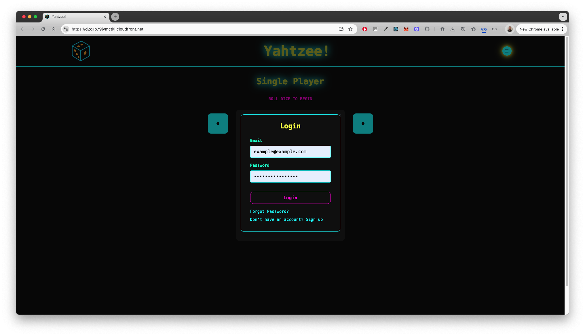
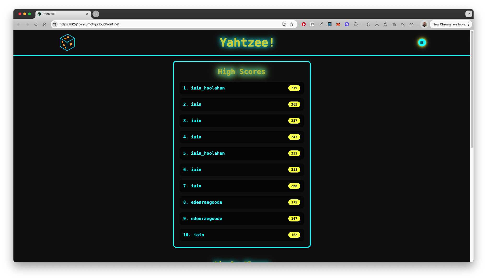

# Yahtzee! Game in React with AWS Integration

## Description

This project is an interactive Yahtzee! game web application developed with React and TypeScript. This digital version of the classic dice game includes features like holding dice, rerolling, and automated score calculations following the official Yahtzee rules. The app integrates AWS Amplify for hosting, AWS Cognito for user authentication, and AWS DynamoDB for persistent storage of leaderboard scores.

## Deployed Page

Access the live application [here](https://d2q1p79jvmctkj.cloudfront.net/).

## Features

- Interactive dice rolling experience with 5 virtual dice
- Option to 'hold' dice between rolls
- Score tabulation following Yahtzee's scoring categories:
  - Three of a Kind
  - Four of a Kind
  - Full House
  - Small Straight
  - Large Straight
  - Yahtzee
  - Chance
- Functional game reset
- User authentication for secure access
- Leaderboard feature to track high scores

## Demo

### 🔐 User Authentication

**Landing Page**  
Shows the welcome screen with access to login and sign-up:


**Login Form**  
Secure user sign-in using AWS Cognito:



---

### 🎮 Gameplay (Single Player)

**Rolling Dice**  
User rolls five dice with visual feedback on remaining rolls:


**Holding Dice**  
Clicking dice allows players to hold values between rolls:


**Locking in Scores**  
Once a valid combination is rolled, users can lock in scores (e.g., Full House, Three of a Kind):


---

### 👥 Two Player Mode

Alternate turns and separate scoring tracked between players:


---

### 🧭 Navigation & UI

**Main Menu**  
Access key features such as the game, leaderboard, about, and settings:


---

### 🏆 Leaderboard

Scores submitted by users are saved and ranked using AWS DynamoDB:



---

### 📱 Mobile Responsive Design

UI adapts for smaller screens with clean layout and functionality:


---

## Architecture

The application's frontend is built using React and TypeScript, with state management handled via React's Context API. AWS Amplify facilitates the frontend deployment and hosting, AWS Cognito provides user authentication services, and AWS DynamoDB is used for storing and retrieving leaderboard data.

## Project Structure

```
.
├── .github/workflows       # CI/CD pipelines
├── .vscode                 # VSCode workspace settings
├── amplify                 # AWS Amplify backend resources
├── public                  # Static assets
├── src                     # Application source code
│   ├── components          # UI components
│   │   ├── auth            # Sign-up, login, email verification
│   │   ├── common          # Reusable UI like About, Settings, Leaderboard
│   │   ├── game            # All Yahtzee gameplay components (Dice, Game, ScoreCard, etc.)
│   │   └── layout          # Navbar, Menu
│   ├── context             # Authentication context
│   ├── graphql             # GraphQL schema, queries, mutations, subscriptions
│   ├── hooks               # Custom React hooks (e.g., useWindowSize)
│   ├── lib                 # Game logic, score calculation, utilities
│   ├── styles              # Tailwind CSS configuration and output
│   ├── tests               # Unit and integration tests
│   ├── App.tsx            # Root application component
│   ├── index.tsx          # React entry point
│   ├── amplify-config.tsx # Amplify setup
│   ├── awsConfig.jsx      # AWS credentials/configs
│   └── setupTests.ts      # Test setup for Jest
├── .eslintignore
├── .gitignore
├── .graphqlconfig.yml
├── README.md
├── package.json
├── package-lock.json
├── tailwind.config.js
└── tsconfig.json
```

## Prerequisites

- Node.js (v14 or later)
- npm (v6 or later)
- AWS Account
- Amplify CLI

## Setup

### Cloning the Repository

```bash
git clone https://github.com/yourusername/yahtzee.git
cd yahtzee
```

### Installing Dependencies

```bash
npm install
```

### AWS Configuration

To interact with the leaderboard, set up AWS Amplify, Cognito, and DynamoDB. Follow the `aws-setup-instructions.md` to configure your AWS resources.

### Environment Variables

Create a `.env` file in the root directory with:

```env
REACT_APP_USER_POOL_ID=your_cognito_user_pool_id
REACT_APP_CLIENT_ID=your_cognito_app_client_id
REACT_APP_AWS_REGION=your_aws_region
REACT_APP_APPSYNC_APIKEY=your_appsync_api_key
REACT_APP_AWS_SYNC_GRAPHQLENDPOINT=your_appsync_graphql_endpoint
REACT_APP_AWS_COGNITO_IDENTITY_POOL_ID=your_cognito_identity_pool_id
REACT_APP_AWS_USER_POOLS_ID=your_cognito_user_pools_id
REACT_APP_AWS_POOLS_WEB_CLIENT_ID=your_cognito_user_pools_web_client_id
```

Replace values with your actual AWS credentials.

## Running the Game Locally

```bash
npm start
```

Visit [http://localhost:3000/](http://localhost:3000/) in your browser.

## Running Tests

```bash
npm test
```

## Contributing

Contributions to improve features or fix bugs are welcome. Fork the repository, create a branch, make your changes, and submit a pull request.

---

We hope you enjoy rolling for that elusive Yahtzee!
